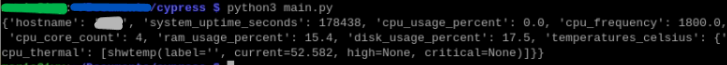

# Raspberry Pi System Manager

A small self-hosted dashboard project for monitoring the health of my Raspberry Pi remotely — from my PC and/or my phone. The backend exposes real-time system stats (CPU, RAM, disk, temperature, uptime, etc.) as a JSON API, which a frontend (in progress) will visualize.

## How it works

- **Backend**: a lightweight Flask API running on the Raspberry Pi that reads live system metrics using `psutil`, and serves them over HTTP.
- **Frontend** (coming soon): a Vue.js dashboard that will consume this API and display the stats in a clean, glanceable UI.

## Project structure

This repo keeps the backend and frontend together for convenience on GitHub. In my actual deployment, they live separately (see [Deployment](#deployment) below).

```
backend/
├── app.py                   # Flask app — exposes the API endpoint(s)
├── main.py                  # Manual test script — prints the API's output to the console
├── system_info_manager.py   # Core logic — collects the actual system stats
├── requirements.txt         # Python dependencies
├── .gitignore
└── LICENSE
frontend/                    # Vue dashboard (coming soon)
```

- **`system_info_manager.py`** — The core of the backend. The `SystemInfoManager` class's `get_system_info()` method gathers system stats and returns them as a dictionary.
- **`app.py`** — Wraps `SystemInfoManager` in a Flask API. Exposes a `GET /cypress-api/system-info` endpoint that returns the current system info as JSON.
- **`main.py`** — Not part of the served app; just a quick way to test `SystemInfoManager` directly by printing its output to the console.

## API

### `GET /cypress-api/system-info`

Returns the current system stats as JSON:

| Field | Description |
|---|---|
| `hostname` | Device hostname |
| `system_uptime_seconds` | Seconds since last boot |
| `cpu_usage_percent` | Current CPU load (%) |
| `cpu_frequency` | Current CPU clock speed |
| `cpu_core_count` | Number of logical CPU cores |
| `ram_usage_percent` | Current RAM usage (%) |
| `disk_usage_percent` | Disk usage (%) for `/` |
| `temperatures_celsius` | Sensor temperature readings |

## Running locally

```bash
cd backend
pip install -r requirements.txt
python app.py
```

The API will be available at `http://<device-ip>:5000/cypress-api/system-info`.
*Choose your own route if you're starting from this project.*

To sanity-check the data collection logic without starting the server:

```bash
python main.py
```

## Deployment

This repo keeps the backend and frontend together in one place for GitHub, but in my real-world setup they're deployed separately and don't live in the same directory:

- **Backend** — kept in a private location on the Pi, run as the Flask API described above.
- **Frontend** — deployed to `/var/www/` on the Pi and served with **lighttpd**, calling the backend API over the local network.

This split keeps the backend private/internal while the frontend can be reached from any device on the network (or beyond, with the right setup).

## Frontend (coming soon)

The frontend isn't here yet. The project is set up with **Vue.js**. The plan is a dashboard that:

- Polls the `/cypress-api/system-info` endpoint on an interval
- Displays CPU, RAM, disk, and temperature stats visually
- Is responsive enough to check comfortably from a phone

This section will be updated once the frontend is underway.

## Tech stack

- **Backend:** Python, Flask, psutil
- **Frontend:** Vue.js
- **Hosting:** Raspberry Pi, lighttpd

## Demo Backend

*Main.py example :*

As you can see in the image, cpu_usage_percent returned 0.0% because it was the first time it ran. This is because of `psutil.cpu_percent(interval=None)`. `psutil.cpu_percent()` requires a previous measurement to calculate CPU utilization. It was a personnal choice for my program to keep it non-blockin,lightweight and fast. `psutil.cpu_percent(interval=1)` makes the program block for 1 second on each call while it measures CPU usage.

## License

See [LICENSE](./LICENSE).